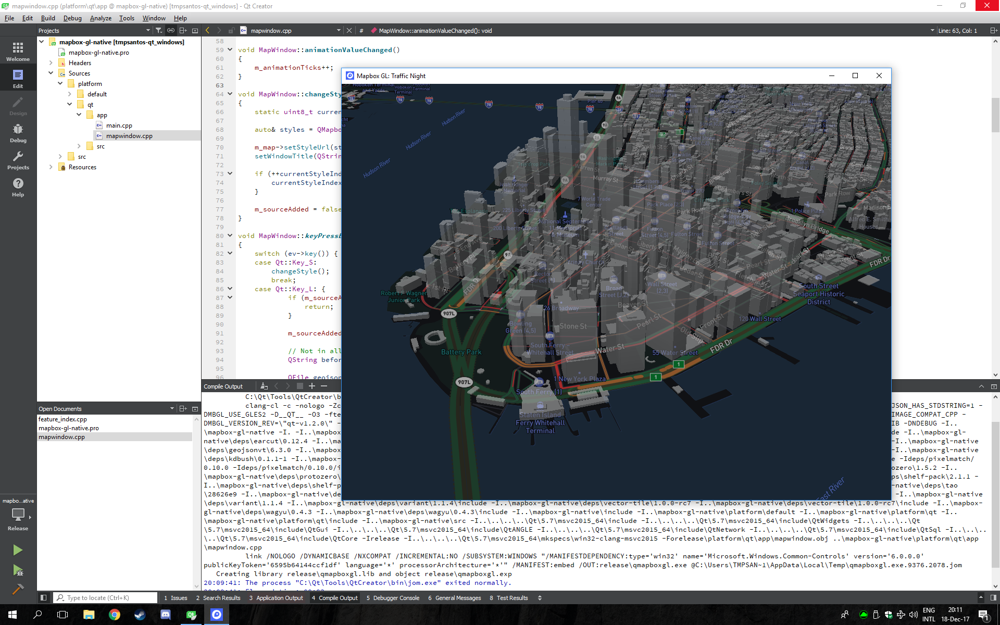
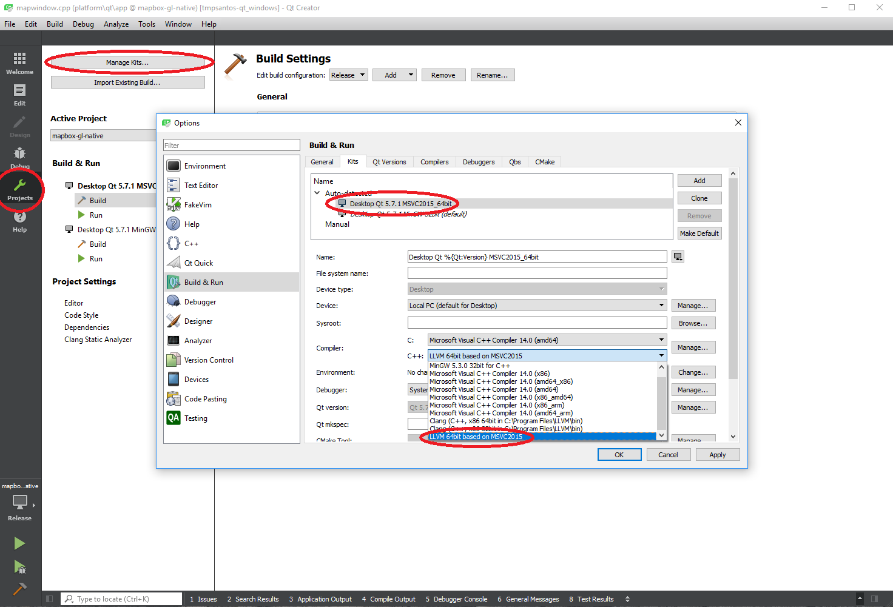

# Mapbox GL Qt on Windows



## Testing environment

- Qt 5.7.1 MSVC 2016 Win64
- LLVM 5.0 Win64
- OpenSSL 1.0.2n Win64
- Visual Studio Community 2015 Update 3
- Qt Creator 4.5.0
- Windows 10
- DirectX 11
 

## Building instructions

1. Open the ```mapbox-gl-native.pro``` project file with Qt Creator
2. Go to Projects -> Manage Kits
3. Change the "MSVC2015_64bit" kit to use "LLVM 64bit based on MSVC2015" compiler
4. QtCreator doesn't always save this configuration, you might need to do it every time after opening the project



3. Select the **Release** configuration
4. Hit the **Build Project** button or **CTRL+B** to build and run the project
5. The project will, by default, build a shared library named `qmapboxgl.dll` that can be used with MSVC projects.
6. If you want to build the test app, add this to the QMake command line: `CONFIG+=TestApplication`


## Demo app instructions

- Press **S** to change the style
- Press **L** to add the 3D buildings layer and add a custom source over Helsinki
- Hold shift and drag with the mouse left button to tilt the map
- Drag with the mouse left button to pan the map
- Drag with the mouse right button to rotate the map

## OpenGL and software rendering

- Qt will select the best OpenGL implementation available automatically
- Running with ANGLE will require DirectX installed
- Software rendering can be forced by uncommenting this [line](https://github.com/tmpsantos/mapbox-gl-native/blob/tmpsantos-qt_windows/platform/qt/app/main.cpp#L8)
