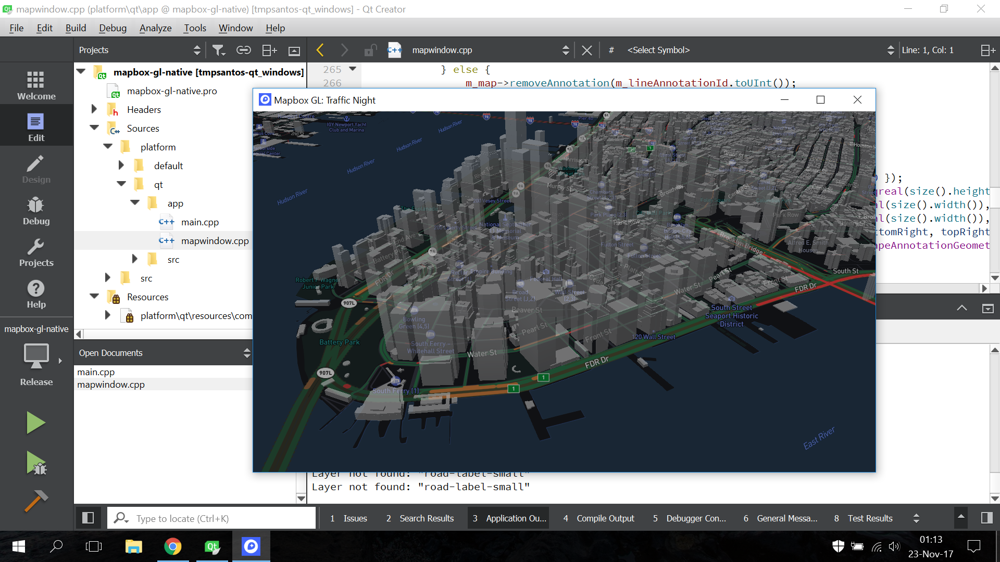

# Mapbox GL Qt on Windows



## Testing environment

- Qt 5.9.3 for Windows with MinGW 32-bits (won't build with MSVC)
- Qt Creator
- Windows 10
- DirectX 11
 

## Building instructions

1. Open the ```mapbox-gl-native.pro``` project file with Qt Creator
2. Select the **Release** configuration
3. Hit the **Play** button or **CTRL+R** to build and run the project


## Demo app instructions

- Press **S** to change the style
- Press **L** to add the 3D buildings layer and add a custom source over Helsinki
- Hold shift and drag with the mouse left button to tilt the map
- Drag with the mouse left button to pan the map
- Drag with the mouse right button to rotate the map

## OpenGL and software rendering

- Qt will select the best OpenGL implementation available automatically
- Running with ANGLE will require DirectX installed
- Software rendenring can be forced by uncommenting this [line](https://github.com/tmpsantos/mapbox-gl-native/blob/tmpsantos-qt_windows/platform/qt/app/main.cpp#L8)
